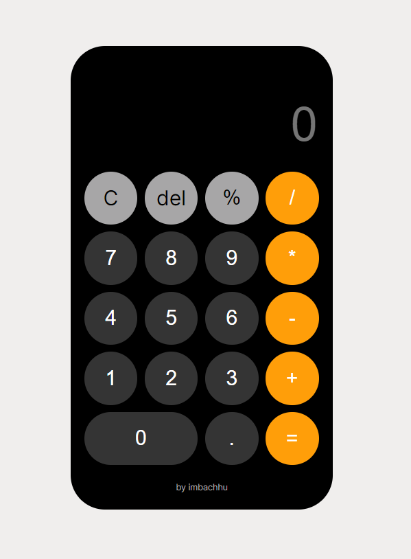

# iOS Calculator (Web-based)

Welcome to the iOS Calculator project! This web-based calculator is built using HTML, CSS, and JavaScript to replicate the appearance and functionality of the iOS calculator app found on Apple devices.

## UI 



## Features

- Basic arithmetic operations: Addition, subtraction, multiplication, and division.
- Advanced functions: Square root, percentage calculations, and more.

## Getting Started

To use this web-based calculator on your local machine, follow these steps:

1. Clone the repository to your local system.
   ```bash
   git clone https://github.com/yourusername/ios-calculator-js.git
